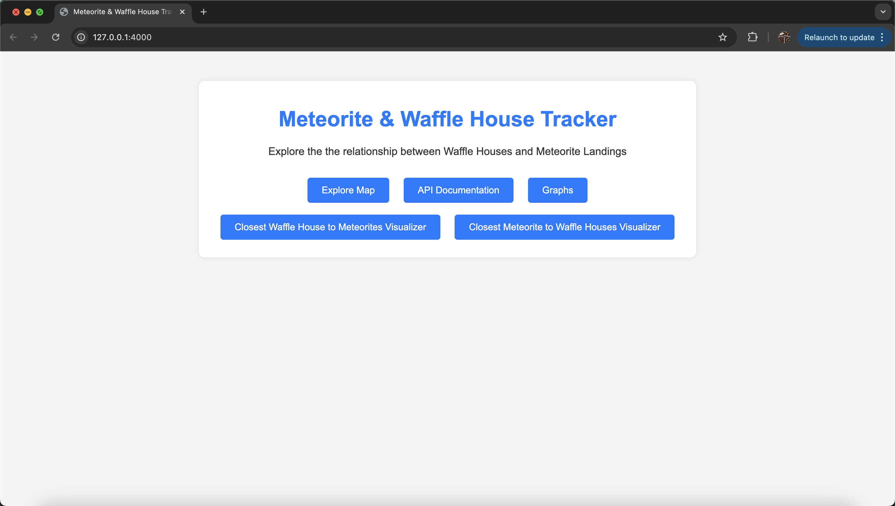
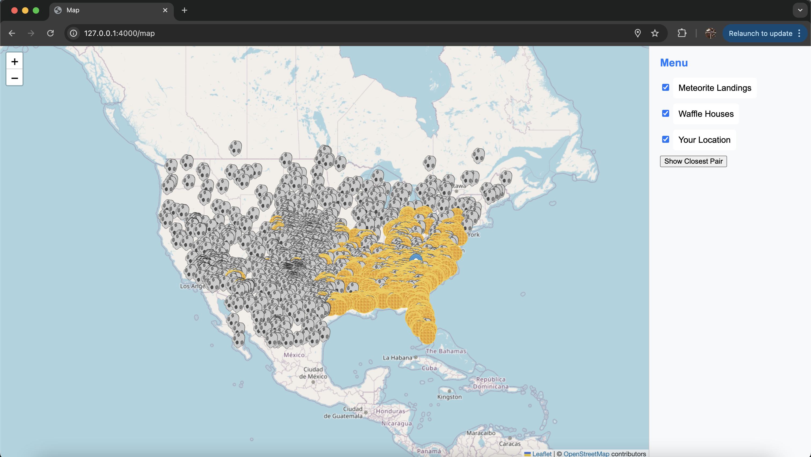
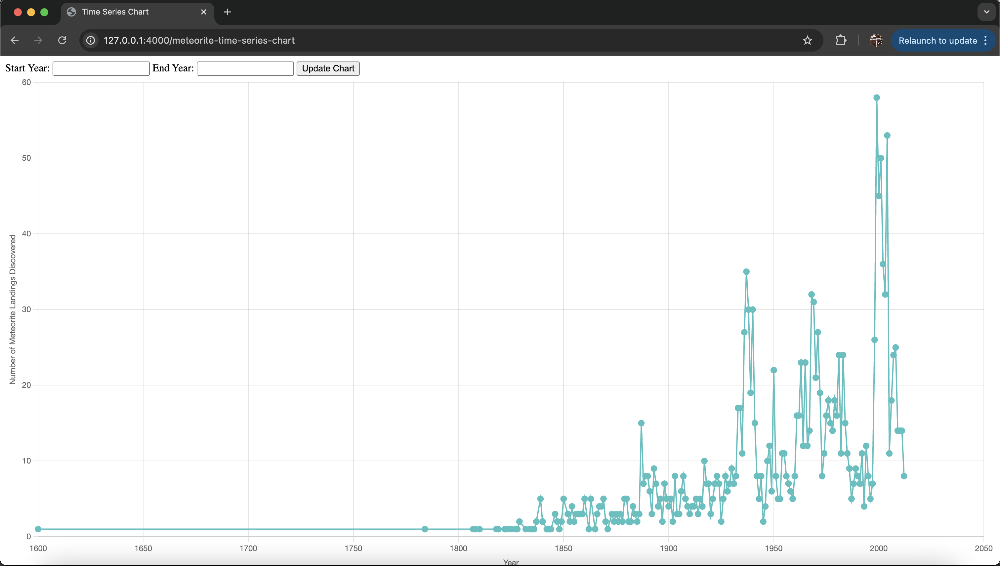
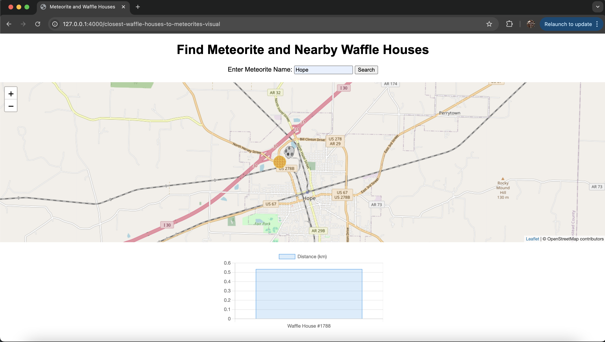
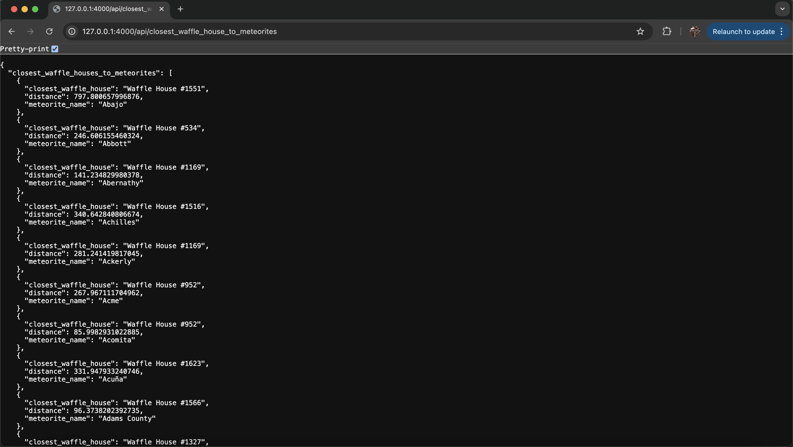

# Waffle House and Meteorite Landing Data Integration and Visualization

## Project Overview

This project is a full-stack web application that integrates and visualizes data on **Waffle House locations** and **meteorite landings** across the USA. The goal is to provide users with an interactive platform to explore the relationship between these two datasets using maps and graphs.

The application uses a combination of **data scraping**, **database management**, **custom API** development, and **dynamic web services** to deliver customizable visualizations.

## Features
- **Data Scraping**: 
  - Scraped Waffle House locations directly from the official website.
  
- **Database**: 
  - Created and normalized an SQLite database containing both Waffle House locations and meteorite landings, ensuring consistent data formatting.
  
- **Custom API**: 
  - Designed and built a custom API with over 20 dynamic routes, supporting complex queries and customizable data responses in both JSON and XML formats.
  
- **Backend**: 
  - Built the backend using Flask to handle requests and provide responses from the API.
  
- **Frontend**: 
  - Developed an AJAX-based client using JavaScript for seamless interaction with the backend API.
  
- **Visualization**: 
  - Integrated **Leaflet** for interactive map visualizations.
  - Used **ChartJS** for dynamic graph generation, providing various data views and analytics.

## Screenshots






## Technologies Used
- **Backend**:
  - Python
  - Flask
  - SQLite
  - Scrappy (for web scraping)
  
- **API**:
  - Flask-based API with dynamic routes for querying data.
  
- **Frontend**:
  - HTML
  - CSS
  - JavaScript
  - AJAX for asynchronous data requests
  - Leaflet for map visualizations
  - ChartJS for dynamic charts
  
- **Data Formats**:
  - JSON/XML
  


## Installation & Setup

1. **Clone the repository**:
   ```bash
   git clone https://github.com/niklasjarman/waffle-houses-vs-meteorites.git
   cd waffle-houses-vs-meteorites
2. **Create a virtual environment (optional but recommended):**  
    ```bash
    python3 -m venv venv
    source venv/bin/activate # On Windows: venv\Scripts\activate
3. **Run the Flask application:**
    ```bash
    python3 webservice.py 
4. **Access the app:** 
Open your browser and go to http://127.0.0.1:4000/.

## Usage
  - Navigate the app using the interactive map to explore Waffle House locations and meteorite landings. 
  - Use the custom API routes to query the data and retrieve results in JSON or XML formats. 
  - Generate dynamic charts to visualize trends and statistics related to Waffle House locations and meteorite impacts.

## API Endpoints

### Meteorite Landings
- **Get all meteorite landings**: `/api/meteorite_landings`
- **Get meteorite landing by name**: `/api/meteorite_landings/name/<name>`
- **Get meteorite landings by type**: `/api/meteorite_landings/type/<recclass>`
- **Get meteorite landings within a mass range**: `/api/meteorite_landings/min_mass/<min_mass>/max_mass/<max_mass>`
- **Get meteorite landings by type and year**: `/api/meteorite_landings/type/<recclass>/year/<year>`

### Waffle Houses
- **Get all Waffle House locations**: `/api/waffle_houses`
- **Get Waffle House by name**: `/api/waffle_houses/name/<name>`
- **Get Waffle Houses by state**: `/api/waffle_houses/state/<state>`
- **Get Waffle Houses by state and zipcode**: `/api/waffle_houses/state/<state>/zipcode/<zipcode>`
- **Get count of Waffle Houses by state**: `/api/waffle_houses/count_by_state`
- **Get count of Waffle Houses by state**: `/api/waffle_houses/count_by_state/state/<state>`

### Average Distance
- **Get average distance to meteorite landings**: `/api/average_distance`
- **Get average distance to meteorite landings for a specific year**: `/api/average_distance/year/<int:year>`
- **Get average distance to meteorite landings for a specific year and Waffle House state**: `/api/average_distance/year/<int:year>/waffle_house_state/SC`

### Closest Pairs
- **Get closest pairs of meteorites and Waffle Houses**: `/api/closest_pairs?limit=num`
- **Get closest pairs within a specified distance**: `/api/closest_pairs/distance/<distance> (float)`

### Closest Meteorites to Waffle Houses
- **Get closest meteorites to a specific Waffle House**: `/api/closest_meteorites/waffle_house_name/Waffle%20House%20%23999?response=xml` (Waffle House name)
- **Get the closest Waffle House to meteorites**: `/api/closest_waffle_house_to_meteorites`
- **Get closest Waffle House to a specific meteorite**: `/api/closest_waffle_house_to_meteorites/meteorite_name/<name>`

### Closest Locations
- **Get closest Waffle Houses to user location**: `/api/closest_waffle_houses_to_me`
- **Get closest Waffle Houses to user location within a specified distance**: `/api/closest_waffle_houses_to_me/max_distance/<distance>` 
- **Get closest meteorites to user location**: `/api/closest_meteorites_to_me`
- **Get closest meteorites to user location within a specified distance**: `/api/closest_meteorites_to_me/max_distance/<distance>`

### Nearby Locations
- **Get nearby locations based on latitude and longitude**: `/api/nearby_locations/latitude/<lat>/longitude/<long>` (To express a negative lat/long, put "neg_" infront of the number.)


    